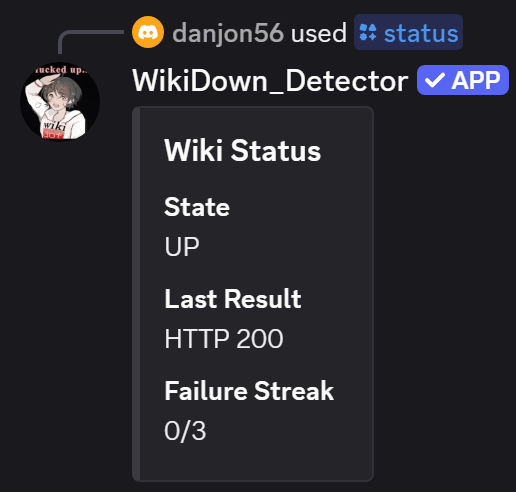

Discord bot for detecting when Wikidot decides to fuck itself again.

# Features:

* Once per minute HTTP request of scp-wiki.wikidot.com. If three of these requests fail in a row, the bot will send a message in a predetermined channel.
* The bot will send another message once the wiki has begun responding normally again.
* Users can get the results of the last request (/status), or manually run a request (/forcecheck).

# Instructions:

## Bot Creation

You need to make a Discord bot with the right permissions in order for this to work. It also needs to be invited to your server.

1. Open your Discord, go to settings, then "Advanced".
2. Enable "Developer Mode".
3. Right click the channel you want the bot to send its messages to. Click "Copy Channel ID", and paste it somewhere safe; it will be needed later.
4. Create a Discord bot at https://discord.com/developers/applications.
5. In the "Bot" menu, copy the Token and paste it somewhere safe; it will be needed later.
6. Select the "OAuth2" menu.
7. In the "OAuth2 URL Generator" menu, select "bot" and "applications.commands".
8. In the "Bot Permissions" menu, select "View Channels" and "Send Messages".
9. For "Integration Type", select "Guild Install".
10. Go to the URL generated at the bottom of the page. It should open Discord, and allow you to add the bot to the server of your choice.
11. In Discord, select the server that contains the channel from Step 3.

## Bot Hosting

If you have done all of the previous steps correctly, you should have an offline bot in your server. To get the bot working, you have two options:

### Local Hosting:
(requires your computer to be constantly on and connected to internet)

1. Ensure you have Python installed on your computer. If you do not, download it at https://www.python.org/downloads/.
2. Create a folder on your computer.
3. Download bot.py and image.png from this repository. Put them into that folder.
4. Create a file called .env in that folder containing:  
DISCORD_TOKEN=(Your Discord Token)  
CHANNEL_ID=(Your Channel ID)  
5. Open File Explorer. Go to the folder you have made containing bot.py and .env.
6. In the search bar at the top of File Explorer, type "cmd" and press enter. A black window with white text should pop up.
7. Type the following commands into the black box. Press Enter after every line:  
pip install -U discord.py aiohttp python-dotenv  
python bot.py  
8. If everything is working, you should see a message in the window that says "Logged in as (Bot Name)#(Bot Numbers) (Channel ID)", and after a few minutes, several messages saying "[OK] HTTP 200".
9. As a final test, try using /status in your server. The bot should display a message showing the wiki's state (up or down), and the last request's result.
10. Keep that window open. If that window ever closes, you will need to redo steps 5-8, excluding the "pip install" command in Step 7.

### Outsourced Hosting:
(Have another company keep the program open for you; more convenient, but will cost money in the long run)

1. Clone this repository. If you don't know how to do that, download the three other files in this repository (bot.py, image.png, and requirements.txt), and upload them to your own repository.
2. Go to https://railway.com and make an account. Click "Deploy", then "GitHub Repository". Sign into your GitHub account, and click "Allow".
3. Select the cloned/newly created repository containing bot.py, image.png, and requirements.txt.
4. You should now see a big dashboard, with a rectangle labeled with your repositories' name in the center. Click that rectangle.
5. A menu will have appeared on the right side of your screen. In this menu, select "Variables".
6. Press the "New Variable" button. In the "VARIABLE_NAME" box, enter DISCORD_TOKEN. In the "VALUE or ${{REF}}" box, enter your Discord token from Bot Creation (Step 5). Press "Add".
7. Repeat Step 6, with "VARIABLE_NAME" being CHANNEL_ID, and "VALUE or ${{REF}}" being the channel ID from Bot Creation (Step 3). Press "Add".
8. A box should appear on screen saying "Apply 2 changes". Press the button labeled "Deploy".
9. Wait for the text in the rectangle under your repositories' name to change from "Building..." or "Deploying..." to "Online". The dot next to these words should have changed from blue to green.
10. Test your bot in the server using /status.
